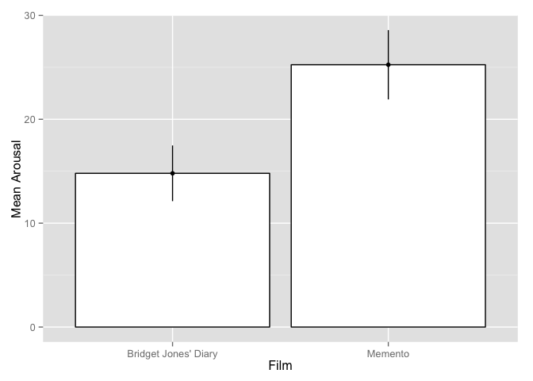
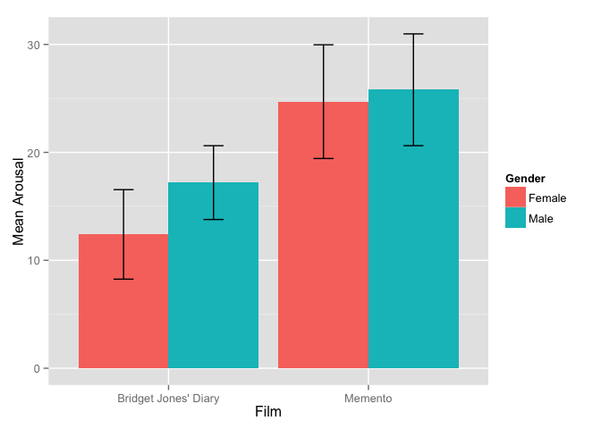
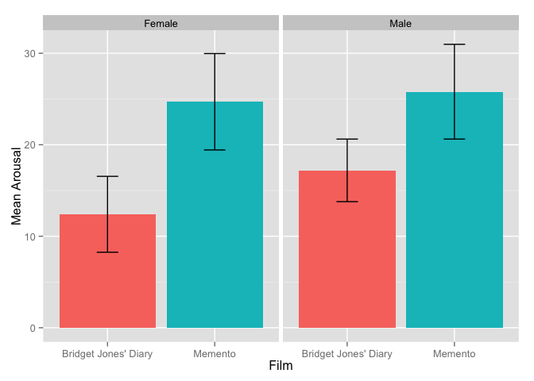
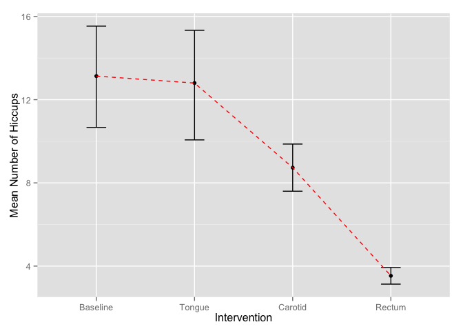
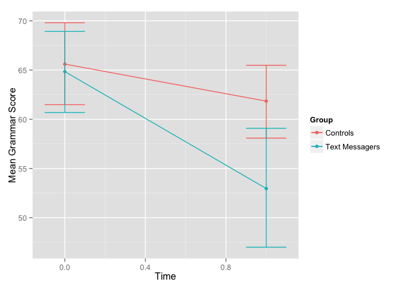
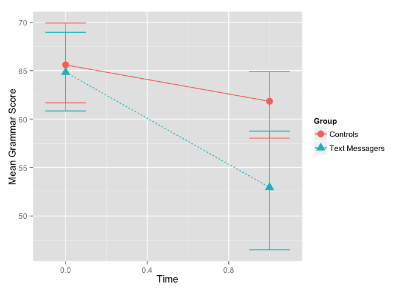

# 4 Exploring Data with Graphs
Sejin Park  
2015.8.12  


```r
setwd("~/Documents/Dropbox/RstatisticsStudy/ch4_graph/data")
library(ggplot2)
```

## Bar charts for one independent variable

```r
chickFlick = read.delim("ChickFlick.dat",  header = TRUE)

bar <- ggplot(chickFlick, aes(film, arousal))
bar + stat_summary(fun.y = mean, geom = "bar", fill = "White", colour = "Black") + stat_summary(fun.data = mean_cl_normal, geom = "pointrange") + labs(x = "Film", y = "Mean Arousal") 
```

 

```r
colours = c(Female = "Red", Male = "Green")
```


# Bar charts for several independent variables 


```r
bar <- ggplot(chickFlick)
bar + stat_summary(aes(film, arousal, fill = gender ), fun.y = mean, geom = "bar", position="dodge") + stat_summary(aes(film, arousal, fill = gender ), fun.data = mean_cl_normal, geom = "errorbar", position=position_dodge(width=0.90), width = 0.2) + labs(x = "Film", y = "Mean Arousal", fill = "Gender")
```

 

bar <- ggplot(chickFlick, aes(film, arousal, fill = gender))
bar + stat_summary(fun.y = mean, geom = "bar", position="dodge") + stat_summary(fun.data = mean_cl_normal, geom = "errorbar", position=position_dodge(width=0.90), width = 0.2) + labs(x = "Film", y = "Mean Arousal", fill = "Gender") + scale_fill_manual("Gender", c("Female" = "Blue", "Male" = "Green"))

bar <- ggplot(chickFlick, aes(film, arousal, fill = gender))
bar + stat_summary(fun.y = mean, geom = "bar", position="dodge") + stat_summary(fun.data = mean_cl_normal, geom = "errorbar", position=position_dodge(width=0.90), width = 0.2) + labs(x = "Film", y = "Mean Arousal", fill = "Gender") + scale_fill_manual("Gender", c("Female" = "#3366FF", "Male" = "#336633"))


```r
bar <- ggplot(chickFlick, aes(film, arousal, fill = film))
bar + stat_summary(fun.y = mean, geom = "bar") + stat_summary(fun.data = mean_cl_normal, geom = "errorbar", width = 0.2) + facet_wrap(~gender) + labs(x = "Film", y = "Mean Arousal") + opts(legend.position="none")
```

```
## Error: 'opts' is deprecated. Use 'theme' instead. (Defunct; last used in version 0.9.1)
```

```r
bar <- ggplot(chickFlick, aes(film, arousal, fill = film))
bar + stat_summary(fun.y = mean, geom = "bar") + stat_summary(fun.data = mean_cl_normal, geom = "errorbar", width = 0.2) + facet_wrap(~gender) + labs(x = "Film", y = "Mean Arousal") + theme(legend.position="none")
```

 


## Line graphs

### Line graphs of a single independent variable

```r
hiccupsData <- read.delim("Hiccups.dat",  header = TRUE)
hiccups<-stack(hiccupsData)
names(hiccups)<-c("Hiccups","Intervention")
hiccups$Intervention_Factor<-factor(hiccups$Intervention, levels(hiccups$Intervention)[c(1, 4, 2, 3)])


line <- ggplot(hiccups,  aes(Intervention_Factor, Hiccups))
line + stat_summary(fun.y = mean, geom = "point") + stat_summary(fun.data = mean_cl_boot, geom = "errorbar", width = 0.2) + labs(x = "Intervention", y = "Mean Number of Hiccups") + stat_summary(fun.y = mean, geom = "line", aes(group=1),colour = "Red", linetype = "dashed")
```

 

### Line graphs for several independent variables 


```r
textData <- read.delim("TextMessages.dat",  header = TRUE)
textData$id = row(textData[1])

textMessages = reshape(textData, idvar = c("id", "Group"), varying = c("Baseline", "Six_months"), v.names = "Grammar_Score", timevar = "Time", times = c(0:1), direction = "long")
```
textMessages<-melt(textData, id = c("id", "Group"), measured = c("Baseline", "Six_months"))
names(textMessages)<-c("id", "Group", "Time", "Grammar_Score")
textMessages$Time<-factor(textMessages$Time, labels = c("Baseline", "6 Months"))

print (textMessages)


```r
line <- ggplot(textMessages, aes(Time, Grammar_Score, colour = Group))
line + stat_summary(fun.y = mean, geom = "point") + stat_summary(fun.y = mean, geom = "line", aes(group= Group)) + stat_summary(fun.data = mean_cl_boot, geom = "errorbar", width = 0.2) + labs(x = "Time", y = "Mean Grammar Score", colour = "Group") 
```

 

```r
line <- ggplot(textMessages, aes(Time, Grammar_Score, colour = Group))
line + stat_summary(fun.y = mean, geom = "point", aes(shape = Group), size = 4) + stat_summary(fun.y = mean, geom = "line", aes(group= Group, linetype = Group)) + stat_summary(fun.data = mean_cl_boot, geom = "errorbar", width = 0.2) + labs(x = "Time", y = "Mean Grammar Score", colour = "Group") 
```

 

